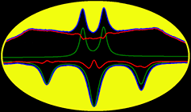

# BATMAN
Version: 1.2.1.08

## Short Description

Bayesian AuTomated Metabolite Analyser for NMR spectra (BATMAN).

## Description

BATMAN: open source software for batch metabolites NMR resonance peak fitting.

BATMAN deconvolves resonance peaks from NMR spectra of complex mixtures and obtains concentration estimates for the corresponding metabolites automatically. This is achieved through a database of spectral profiles for known metabolites and a Bayesian Markov Chain Monte Carlo algorithm.

Users have the options to specify the multiplet ppm position, position shift range, peak width range and so on. Parallel processing is available if processing several spectra. The installation and testing instructions can be found at:
http://batman.r-forge.r-project.org/.

## Key features

- NMR Processing

## Functionality

- Annotation / NMR
- Post-processing

## Approaches

- Metabolomics / Targeted
?
## Instrument Data Types

- NMR / 1D NMR

## Screenshots

Screen shots obtained from the original BATMAN page.

## Tool Authors

- Jie Hao (Imperial College London)
- William Astle
- Maria De Iorio (University College London)
- Timothy Ebbels (Imperial College London)

## Container Contributors

- [Jianliang Gao](https://github.com/jianlianggao) (Imperial College London)

## Website

- http://batman.r-forge.r-project.org/


## Git Repository

- https://github.com/phnmnl/container-batman.git

## Installation 

For local individual installation:

```bash
docker pull docker-registry.phenomenal-h2020.eu/phnmnl/batman
```

## Usage Instructions

For direct docker usage:

```bash
docker run docker-registry.phenomenal-h2020.eu/phnmnl/batman ...
```

## Publications

- Hao, J., et al., BATMAN¨Can R package for the automated quantification of metabolites from nuclear
magnetic resonance spectra using a Bayesian model. Bioinformatics, 2012. 28(15): p. 2088-90.
http://bioinformatics.oxfordjournals.org/content/28/15/2088
- Astle, W., et al., A Bayesian Model of NMR Spectra for the Deconvolution and Quantification
of Metabolites in Complex Biological Mixtures. Journal of the American Statistical Association,
2012. 107(500): p. 1259-1271.
http://www.tandfonline.com/doi/abs/10.1080/01621459.2012.695661#.UgEf-hbZa4k.
